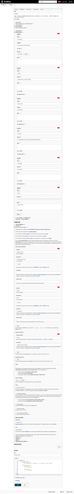

# All in KIND

中文 | [English](README_en.md)

这个项目旨在教你使用 [Kind](https://github.com/kubernetes-sigs/kind) 快速在你的个人计算机上构建全功能的 Kubernetes 集群。

你可以跟着这个教程一步一步学习构建一个生产完备的 Kubernetes 集群。

由于它是基于 Kind，所以首先，你得确保你的计算机已经安装了 Docker。

## 安装 Kind

该部分的内容参考自 Kind 的[官方文档](https://github.com/kubernetes-sigs/kind#installation-and-usage).

在 Linux 上：

```bash
curl -Lo /usr/local/bin/kind "https://kind.sigs.k8s.io/dl/v0.11.1/kind-$(uname)-amd64"
chmod +x /usr/local/bin/kind
```

在 macOS 上（使用 Homebrew）:
```bash
brew install kind
```

在 Windows 上（使用 Chocolatey）:
```powershell
choco install kind

# 或者你也可以试试 winget 这个微软官方出品的包管理工具 :)
```

## 创建集群

为了方便网络访问和持久化（生产中应尽量使用网络存储，如 NFS 等），我写了一个配置文件“[config.yaml](config.yaml)”，告诉 Kind 暴露 80 和 443 端口，并且挂载了一个目录到容器里，这个目录的路径为“/root/kind”，你可以替换成你想要存储你数据的地方。

```bash
kind create cluster --config config.yaml
```

可能还不到 5 分钟时间（除去下载 Kind 镜像的时间），我们就得到了一个本地 Kubernetes 集群。爽！！

## 安装 ingress

我们使用 Nginx Ingress 作为 Kubernetes Ingress 组件。

Nginx Ingress 组件安装的描述文件在“[ingress-nginx.yaml](ingress-nginx.yaml)”，修改自[这里](https://raw.githubusercontent.com/kubernetes/ingress-nginx/main/deploy/static/provider/kind/deploy.yaml)（主要是将镜像源改为国内，让你尽量不需要魔法上网就能愉快食用）。

```bash
kubectl apply -f ingress-nginx.yaml
```

## 搭建基础设施

```bash
# 创建基础设施放置的命名空间
kubectl create namespace infra

# 安装私有镜像仓库 Registry
kubectl apply -f infra/registry.yaml -n infra

# 等待 Registry 安装完毕之后，你可以通过如下命令获取访问镜像仓库的用户名和密码
kubectl rollout status deployment registry -n infra
export REGISTRY_POD_NAME=$(kubectl get pod -l app=registry -n infra -o jsonpath='{.items[0].metadata.name}')
export REGISTRY_LOG=$(kubectl logs $REGISTRY_POD_NAME -n infra | grep "password=")
export REGISTRY_PASSWORD=$(echo ${${REGISTRY_LOG#*password=}% user=docker*})
echo "Username: docker\nPassword: $REGISTRY_PASSWORD"

# 安装 Chartmuseum
kubectl apply -f infra/chartmuseum.yaml -n infra

# TODO EFK
```

## CI/CD 搭建

在这个部分，将讲述如何使用 Git 和 Jenkins 进行项目 CI/CD 的配置。

### 安装 Gitea

这里选用了 [Gitea](https://github.com/go-gitea/gitea) 这个开源的 Git 管理平台作为我们存储项目代码的地方，它是用 Go 编写的，最初是由 [Gogs](https://github.com/gogs/gogs) 项目 fork 而来。选择它是因为它足够轻量，占用资源少，且上手简单。当然，你也可以使用 GitLab 之类的版本管理平台进行私有部署，或者直接使用公用的 [GitHub](https://github.com/)、[GitLab](https://about.gitlab.com/)、[Gitee](https://gitee.com/) 等等。

```bash
kubectl apply -f infra/gitea.yaml -n infra
```

等待 Gitea 的 Kubernetes 资源都创建完毕后，我们还需要用浏览器访问 [http://gitea.localhost](http://gitea.localhost)，也就是 Gitea 的首页，进行配置安装。


为了后续 Jenkins 能够拉取到我们项目的代码，我们还需要创建一下我们的 Git SSH Key，我们可以通过如下命令进行生成：

```bash
ssh-keygen -t rsa -f jenkins_rsa_key -C jenkins -P ''
```

然后我们就会得到“jenkins_rsa_key”和“jenkins_rsa_key.pub”两个文件，分别存放我们的私钥和公钥。

回到 Gitea 的页面中，我们点击右上角用户头像，选择“设置”，找到“SSH / GPG 密钥”并点击进入，然后点击“增加密钥”，“密钥名称”随意输入，我这边输入的是“jenkins”，然后在“密钥内容”里输入公钥“jenkins_rsa_key.pub”里的文件内容，最后点击“增加密钥”即可。

### 安装 Jenkins

```bash
kubectl apply -f jenkins/jenkins.yaml

# 创建 Jenkins 拉取 Pod 镜像的 Kubernetes Secret
kubectl create secret docker-registry regcred \
  --docker-server=http://registry.infra.svc.cluster.local:5000/v1/ \
  --docker-username=docker \
  --docker-password=$REGISTRY_PASSWORD \
  -n jenkins
```

类似的，等待 Jenkins 的 Kubernetes 资源都创建完毕后，我们还需要用浏览器访问 [http://jenkins.localhost](http://jenkins.localhost)，也就是 Jenkins 的首页，进行配置安装。

初次进入 Jenkins 的首页，我们需要输入 Jenkins 初始化管理员密码，这个我们可以通过下面的方式获取到：

```bash
# 获取 Jenkins 初始化管理员密码
kubectl rollout status deployment jenkins -n jenkins
export JENKINS_POD_NAME=$(kubectl get pod -l app=jenkins -n jenkins -o jsonpath='{.items[0].metadata.name}')
export JENKINS_PASSWORD=$(kubectl exec $JENKINS_POD_NAME -n jenkins -- cat /var/jenkins_home/secrets/initialAdminPassword)
echo $JENKINS_PASSWORD
```

输入密码之后，我们点“继续”，来到下一步，这个时候 Jenkins 会让我们选择要安装的插件，我们选择“安装推荐的推荐”，然后只要等待插件安装完成即可。

等待插件安装完毕后，Jenkins 会要求我们创建管理员用户，这里为了方便，我们直接选择“使用 admin 账户继续”，用这种方式的话，管理员密码会沿用之前的 Jenkins 初始化管理员密码，我们也可以在此后重置它。

接着 Jenkins 会提示我们配置 Jenkins URL，这个地方我们输入“[http://jenkins.localhost](http://jenkins.localhost)”，也就是我们在 Jenkins Ingress 配置的域名，然后点击“保存并完成”。

至此，Jenkins 的初始化配置过程已经完成，接下来我们需要配置的 Kubernetes 构建节点。

如果上面的步骤都顺利进行了，那么这个时候网页会自动跳转到 Jenkins 首页，我们在 Jenkins 首页左侧菜单里点击进入到“系统管理”，然后在“管理 Jenkins”页面里找到“插件管理”的模块并点击进入，然后点击“可选插件”选项页，然后找到“Kubernetes plugin”和“Generic Webhook Trigger Plugin”（方便在我们推送项目代码的时候自动触发构建过程）进行安装（可利用搜索去更快找到需要的插件），安装完毕之后按照提示重启我们的 Jenkins。

待 Jenkins 重启完毕后，我们再一次进入到“管理 Jenkins”页面，找到“Manage Credentials”模块并点击进入。然后在“Stores scoped to Jenkins”列表里的域那一列，找到“全局”，点击进入“全局凭据”页面，点击左侧菜单里的“添加凭据”，我们需要通过这里新增以下两个凭据：

1. Git SSH 密钥：类型为“SSH Username with private key”，描述可随意，我们填入“git”，“Username”填入“jenkins”，“Private Key”选择“Enter directly”，然后填入我们生成的 SSH 密钥（前面生成的“jenkins_rsa_key”里的内容）。
2. Jenkins WebHook Trigger 的统一口令：类型为“Secret text”，描述可随意，我们填入“trigger”，然后填入我们自定的口令。

我们再回到“管理 Jenkins”页面，找到“节点管理”的模块并点击进入，然后在左侧菜单里点击进入到“Configure Clouds”，并按照下图进行配置（注意，有些选项是默认隐藏起来的，需要我们点击详情进行详细配置）：


填写完毕之后点击“Save”进行保存。

接下来我们回到终端上，准备 Jenkins Kubernetes 构建节点的 Docker 镜像构建。

我们的构建过程中需要用到 [kaniko](https://github.com/GoogleContainerTools/kaniko)、[kubectl](https://github.com/kubernetes/kubectl)、[helm](https://github.com/helm/helm) 等工具，为了方便，我们选择构建我们自定义的构建节点的 Docker 镜像。镜像相关的文件（包括构建和部署的脚本）我放在了“jenkins/slave”目录下，你可以进入到这个目录并进行镜像的构建。

```bash
cd jenkins/slave

# 直接用 docker build 命令进行构建
docker build -t registry.localhost/slave-kubernetes:0.0.1 .

# 或者你也可以用 docker-compose build 进行构建
docker-compose build
```

然后为了让 Jenkins 在进行构建时，能够找到我们的镜像，我们还需要把镜像推送到我们指定的镜像仓库里，前面我们已经用 Registry 搭建了一个我们私有的 Docker 镜像仓库，我们可以登录到我们的镜像仓库，然后推送上去：

```bash
# 登录到我们的私有 Docker 镜像仓库
docker login registry.localhost
# 输入我们在搭建时获取到的用户名和密码

docker push registry.localhost/slave-kubernetes:0.0.1
```

由于我们镜像仓库用的是 http 协议，而 docker login 默认是用的 https 协议，所以在我们登录的时候，应该是会验证失败，我们只需要在 Docker 配置文件（一般会放在“/etc/docker/daemon.json”）把我们的镜像仓库加入到“insecure-registries”即可，就像这样：

```json
{
  "insecure-registries": [
    "registry.localhost"
  ]
}
```

然后我们重启下 Docker 再重新登录推送即可。

```bash
# 重启 Docker
service docker restart
```

### 创建 Kubernetes 集群角色

为了方便后边我们项目的部署和调试，我们可以创建 clusterrole-deployer 和 clusterrole-debugger 这两个 Kubernetes 集群角色，这两个角色已经分别配置了部署和调试时我们需要访问的 Kubernetes 资源权限，后边我们创建项目的服务账号的时候可以直接建立权限关联，具体可以参考 [clusterrole.yaml](clusterrole.yaml)。

```bash
# 创建 Kubernetes 集群角色
kubectl apply -f clusterrole.yaml
```

## 项目配置

在这里，我们用一个简单的 Web 静态网站来做示范，并将该项目命名为“sample”。

### 创建仓库

在浏览器地址栏里输入“[http://gitea.localhost](http://gitea.localhost)”回车进入到 Gitea，点击右上角的加号，选择“创建仓库”，并按照下图进行信息填写并创建仓库。


### 创建命名空间和服务账号

```bash
export NAMESPACE_NAME="sample-test"

# 创建命名空间
kubectl create namespace $NAMESPACE_NAME

# 创建从私有仓库拉取镜像的凭证
kubectl create secret docker-registry regcred \
  --docker-server=http://registry.infra.svc.cluster.local:5000/v1/ \
  --docker-username=docker \
  --docker-password=$REGISTRY_PASSWORD \
  -n $NAMESPACE_NAME

# 创建调试和部署的服务账号
kubectl create serviceaccount deployer -n $NAMESPACE_NAME
kubectl create serviceaccount debugger -n $NAMESPACE_NAME

# 将服务账号和对应的权限关联起来
kubectl create rolebinding deployer --clusterrole=deployer --serviceaccount=$NAMESPACE_NAME:deployer -n $NAMESPACE_NAME
kubectl create rolebinding debugger --clusterrole=debugger --serviceaccount=$NAMESPACE_NAME:debugger -n $NAMESPACE_NAME

# 获取部署服务账号的口令
export DEPLOYER_SECRET_NAME=$(kubectl get serviceaccount deployer -n $NAMESPACE_NAME -o jsonpath='{.secrets[0].name}')
export DEPLOYER_TOKEN=$(kubectl get secret $DEPLOYER_SECRET_NAME -n $NAMESPACE_NAME -o jsonpath='{.data.token}' | base64 -d)
```

### 配置流水线

在浏览器地址栏里输入“[http://jenkins.localhost](http://jenkins.localhost)”回车进入到 Jenkins，点击左侧菜单里的“新建任务”，输入任务名称“sample”，选择“流水线”，点击“确定”进入到流水线配置，并按照下图进行信息填写并保存。



### 编写项目代码

```bash
# 克隆项目仓库
git clone http://gitea.localhost/gitea/sample.git
# 输入 Gitea 的账号密码

cd sample

# 由于在 Jenkins 流水线配置了只有在 release 分支推送了代码才会触发构建，所以我们需要切换到 release 分支
git checkout release/0.0.1

echo "Hello world" > index.html
cat > Dockerfile << EOF
FROM nginx:alpine
COPY index.html /usr/share/nginx/html/
EOF

# 创建构建时的环境变量配置
cat > .env << EOF
export APP_NAME=sample
export APP_VERSION=0.0.1
EOF

# 创建 Helm chart
mkdir chart && cd chart
helm create sample
cat > sample/values.yaml << EOF
replicaCount: 1

image:
  repository: registry.infra.svc.cluster.local:5000/gitea/sample
  pullPolicy: IfNotPresent
  tag: ""

imagePullSecrets:
- name: regcred
nameOverride: ""
fullnameOverride: ""

serviceAccount:
  create: true
  annotations: {}
  name: ""

podAnnotations: {}

podSecurityContext: {}

securityContext: {}

service:
  type: ClusterIP
  port: 80

ingress:
  enabled: true
  className: ""
  annotations: {}
  hosts:
    - host: sample.localhost
      paths:
        - path: /
          pathType: ImplementationSpecific
  tls: []

resources: {}

autoscaling:
  enabled: false

nodeSelector: {}

tolerations: []

affinity: {}
EOF
cd ..

git add .
git commit -m "Initial commit"

# 推送项目代码
git push origin release/0.0.1
```

## 参考

* [kind](https://kind.sigs.k8s.io/)
* [Docker Registry | Docker Documentation](https://docs.docker.com/registry/)
* [ChartMuseum - Helm Chart Repository](https://chartmuseum.com/)
* [Jenkins](https://www.jenkins.io/)
* [Gitea](https://gitea.io/en-us/)
